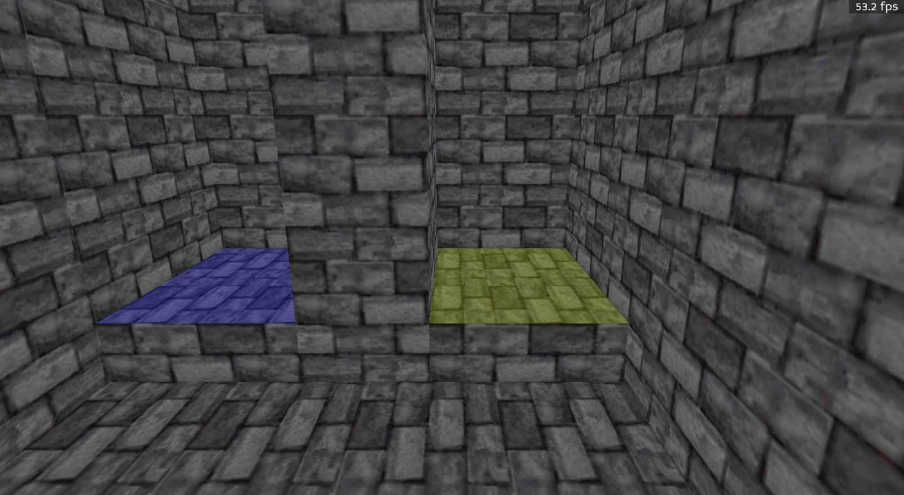

# Modifying The Shape Of Your Map

At the core of making maps, you'll have to add in new rooms (sectors), walls, and sprites. There are many options available in BlooM, and they are detailed below:

## Moving Things Around

Once you've [selected](NAVIGATION.md###selecting-objects-in-3d) the objects you want to modify there are two different ways of moving things around, depending on the objects you've selected. There is standard movement, done by holding control and the left mouse button, and modified, done by holding shift and the left mouse button. Moving is done by moving the mouse in any direction, more details below:

### Sprites

Default Movement: The sprite will be moved up/down along the z axis based on the vertical movement of the mouse.

Modified Movement: The sprite will be moved along the x/y plane based on the movement of the mouse and the direction of the camera.

### Walls

Default Movement: Both vertices making up the wall will be move along a perpendicular direction to the wall, based on the movement of the mouse and the direction of the camera.

Modified Movement: Both vertices will be moved along the x/y plane based on the movement of the mouse and the direction of the camera.

### Verticies

Default Movement: The first vertex of the wall will be move along the direction of the wall, based on the movement of the mouse and the direction of the camera.

Modified Movement: The first vertex of the wall will be moved along the x/y plane based on the movement of the mouse and the direction of the camera.

## Extruding Geometry

It's possible to quickly create a new sector from a wall, for example to create a hallway. Simply select the wall and press shift + space. Doing so will "extrude" the wall outwards as shown below:

Similar can be done with [floors and ceilings](ROR.md).

## Wall Split

You can also add additional vertices to a wall to make geometry more complex by pressing space:

## Adding In New Sectors

There are two ways to add in BlooM, either by inserting a shape within the sector or by splitting walls within a sector.

### Adding a new shape

Pressing insert inside of a sector (away from a wall) will allow you to start drawing a new sector. Clicking will add additional points, while pressing backspace will remove a point. To finish the new sector, you can either press enter or click on the start point for the new shape. You can cancel the new sector by pressing escape. Drawing will look as such:

### Wall Split

Wall split works much the same as adding a new shape, but requires a start and finish point along a wall within the same sector. It'll look as such:

## Joining Two Walls Together

When two walls overlap each other, given that there is a path from the sector containing the first wall to the sector containing the second sector, will be joined together, with walls being split as necessary.

You can start with this:

Move one wall to overlap with the other, and then end up with this:

## Slopes

Floors and ceilings can have slopes applied to them. This is useful for creating things like escalators or broken sections after an wall crack is blown up. To decrease the slope, press `;` or press `'` to increase. The slope direction depends on the first wall in the sector. See [below](##setting-the-first-wall-of-a-sector) for details on how to set the first wall.

## Texture Relative Positioning

Pressing `r` on a floor or ceiling will toggle a texture's relative positioning to the first wall in the sector. See [below](##setting-the-first-wall-of-a-sector) for details on how to set the first wall.

## Setting The First Wall Of A Sector

To set the first wall of a sector, press `1` while highlighting a wall. Slopes and relative texture position will be updated immediately.

## Adding sprites

You can add a new sprite simply by pressing `s` on a floor or ceiling

## Sprite Angles

Sprite angles can be updating by pressing `,` to decrease, or `.` to increase.

## Sprite And Wall Blocking

Changing how a sprite or 2 sided wall blocks movement can be done by pressing `n`

## Doing The Same In 2D

Most, if not all actions described above can be done in 2d editing mode with the same controls and behaviour.

## Panning

You can reposition the offset of a texture on a wall, floor, or ceiling by presssing shift + any of the arrow keys. Doing so on a sprite will instead change the repeats attribute (scaling).

## Auto X-Panning

Panning one wall at a time to align things can be a pain. You can auto align things by pressing shift + `.` on a wall to align adjacent walls with the same texture.

## Repeats

You can reposition the offset of a texture on a wall or sprite by presssing control + any of the arrow keys. Doing so on a floor or ceiling will instead change the panning.

## Facing

Pressing `r` will change a sprite's facing property. This will swap between facing (billboard, following the camera), wall (flat facing the sprite angle, used for things like switches) or a floor sprite (aligned with the floor/ceiling and rotated to the sprite angle).