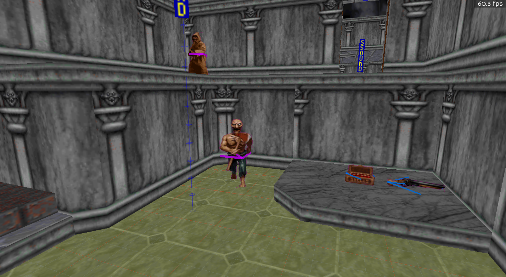
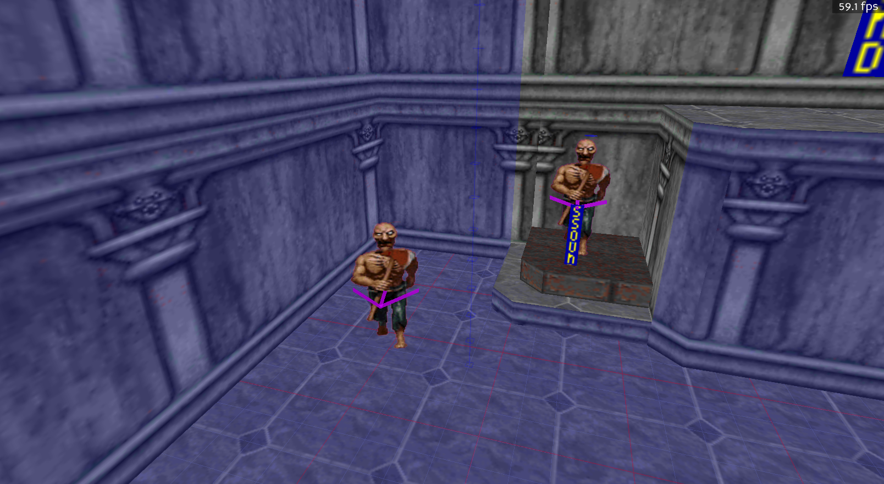
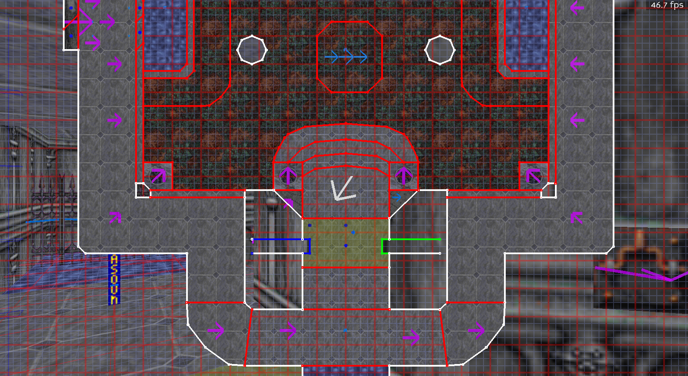
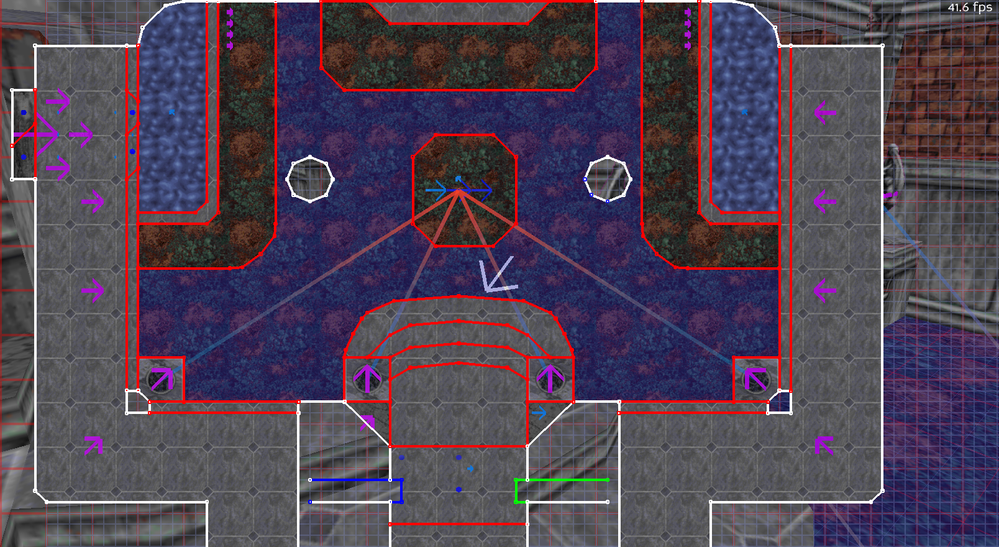

# Navigation

Moving around in BlooM is primarily done using the mouse. Most of the movements will be done by a combination of one or two mouse buttons and moving the mouse at the same time.

## 3D

### Moving Around In 3D

There are 3 types of ways to move around:

- Left mouse button + moving the mouse = moving forward/backward or strafing left/right
- Right mouse button + moving the mouse = rotate the mouse
- Left and right buttons together + moving the mouse = moving up/down or strafing left/right

### Selecting Objects In 3D

There are a couple ways to select objects:

- Left click = select a single object. This will de-select if another object is clicked
- Control + left click = select an additional single object. Everytime you click, another object is selected
- Shift click on the floor or ceiling of a sector = select the floor, ceiling and all walls in the sector

Yellow higlights will show up indicating what object can be selected,

And when selected, the object will be highlighted in blue.

## 2D

### Moving Around In 2D

There are 2 types of ways to move around:

- Left mouse button + moving the mouse = panning up/down/left/right
- Left and right buttons together + moving the mouse = zoom in/out or panning left/right

### Selecting Objects In 2D

This works much the same as in [3d mode](###selecting-objects-in-3d), but the way items are shown and highlighted is done in a 2-dimensional view.

Yellow higlights will show up indicating what object can be selected,

And when selected, the object will be highlighted in blue.

