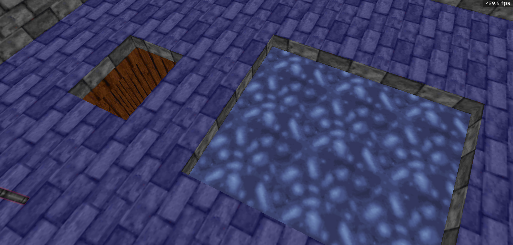

# ROR (Room Over Room) Effects In BlooM

Adding and view ROR effects in BlooM has been made convenient and quite useful. Rather than spending the time to create multiple sectors, insert markers of different types, and then find unique IDs for them, you simply need to point at the floor/ceiling you want to have ROR, and then press shift+space.

After that a dialog will pop up and ask you what kind of ROR you'd like (link, stack, water, etc.):

Clicking ok will confirm the type and create the necessary map objects on your behalf:

