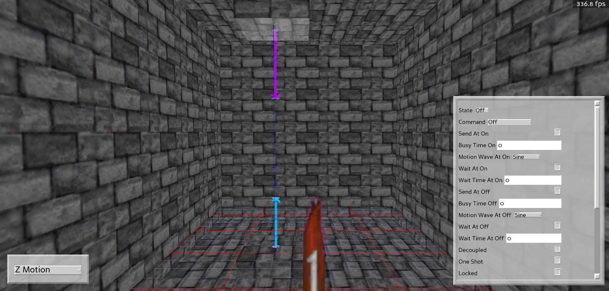
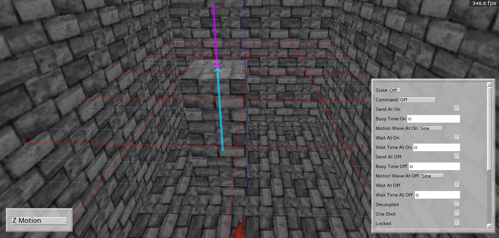
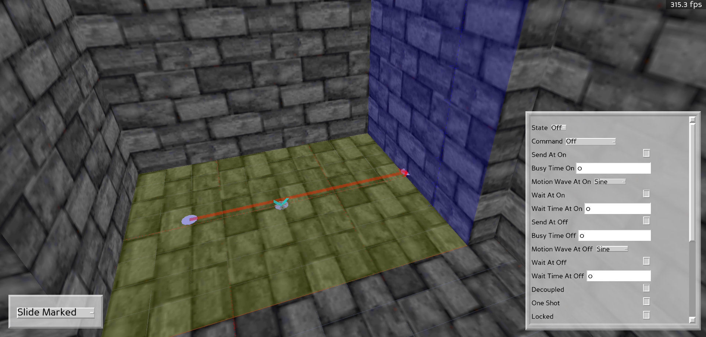
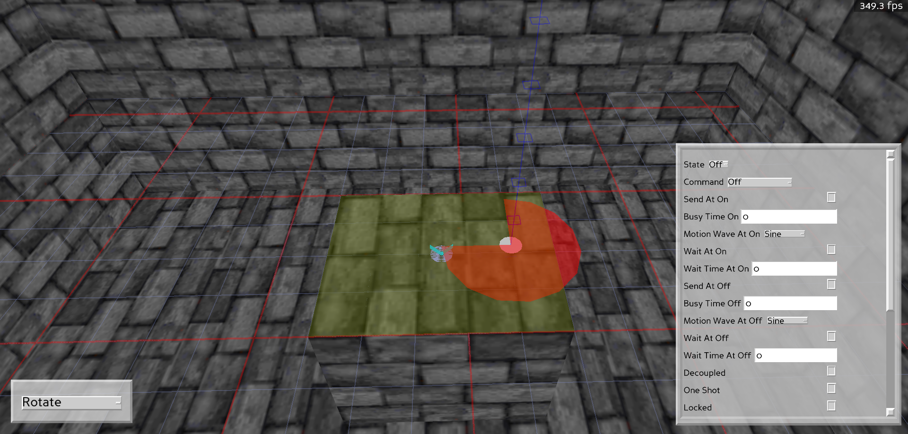

# Editing Sectors

Setting up special sectors works much like [setting up special sprites](SPECIAL_SPRITES.md), except things are a bit more interactive in 3d mode. Here you can set up and display the sector movement. Some examples will be detailed below:

## Sector Types

### Marked types

Before looking at the details below, it's important to understand that some sector types require that objects be "marked" for motion. How they move can be done by [highlighting](NAVIGATION.md###selecting-objects-in-3d) the object and pressing `k` to toggle the behaviour. Like in mapedit, blue represents moving in the same direction as the sector motion, while green indicates moving in the opposite direction. Other colours imply that no movement will happen in a marked sector type.

### Z motion

This behaviour actually applies to most, if not all special sector types. A display will show up to indicate from where the floor/ceiling starts at and where it will move to:

You can then move the floor/ceiling as describe [here](MAP_GEOMETRY.md) to where you want to change the off/on positions of. Pressing `1` on the floor/ceiling will set it's start or "off" position, while pressing `2` will set it's finished or "on" position.

### Slide

This sector type has moveable markers that determine the start and end position. Moving these works much the same as moving sprites [in 3D mode](MAP_GEOMETRY.md).

### Rotate

Rotate works much like slide in that there is an indicator that can be manipulated to show how much the objects will rotate. You'll need to move the marker to the pivot/origin of the rotation, and then change it's angle [much like you would for a sprite] (MAP_GEOMETRY.md) to indicate how far it will rotate.

## Sector Properties

Sector triggers and properties work much the same as sprites, please see [there](SPECIAL_SPRITES.md) for more details
