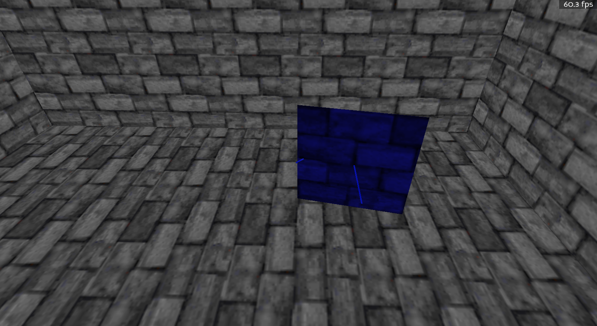
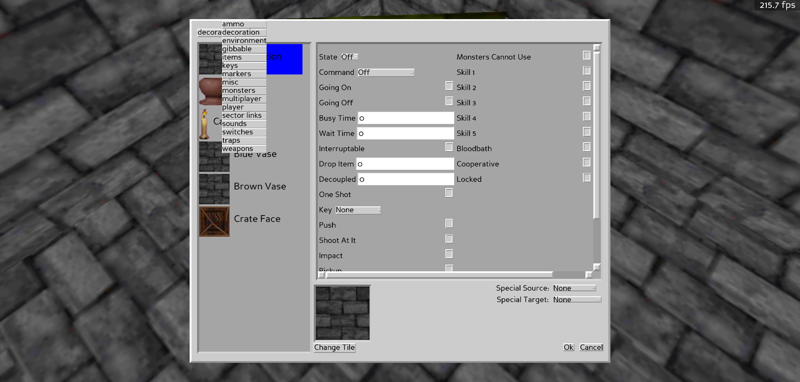
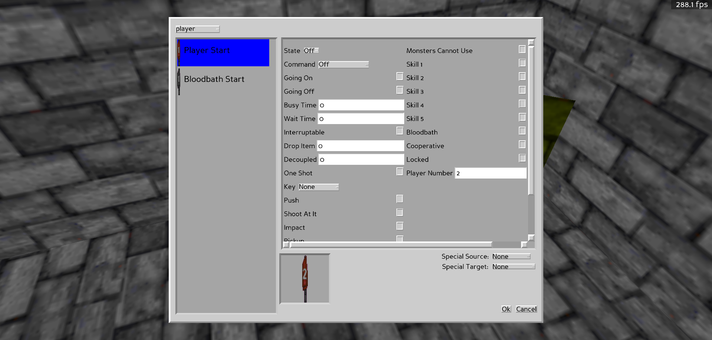
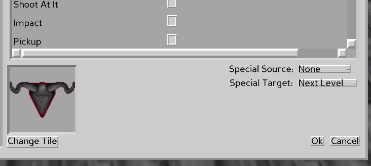

# Editing Sprites

## Setting Up A Sprite

It is very easy to start setting up an object (sprite) in your map. To start, you simply need to double click on the sprite you're interested in:

Then you can select what type of sprite you want:

And then setting the properties on that sprite:

## More On Different Types Of Sprite Properties

There are currently 4 different types of supported sprite properties:

- integers = numbers use to specify things like ranges, volumes, counts, etc.
- booleans = toggle-able values, such as whether or not something is locked
- sounds = self-explanatory, browsing them is done via the [sound browser](SPRITE_SOUNDS.md)
- enums = a specific subset of options to select from. Examples include state, command, motion waves, etc.

## Selecting A Sprite Tile

Clicking the tile image or `Change Tile` will take you to the tile selection dialog, which will provide you will a subset of valid tiles that apply to this particular sprite type. More info on selecting tiles [here](TEXTURES.md)

## Triggering Or Being Triggered By A Special Event

It's possible to either:

A. Trigger an object based on a special event. Say for example, when the map starts OR
B. Have the object trigger a special event, such as a level end

These are configured through the following drop downs:

