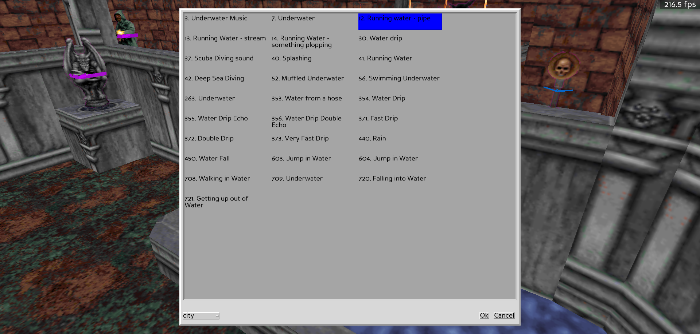

# Browsing Sounds

Looking for a sound to make Caleb speak, or perhaps make your map a bit creepier? The sound browser should make it a lot easier to do then what had to be done in the past. Simply select a category of sounds from the drop down, listen to a preview of the sound by clicking on it (names adapted from [here](http://www.r-t-c-m.com/knowledge-base/library-online/blood-mapedit-sector%20ambient%20sfx%20list.html))

