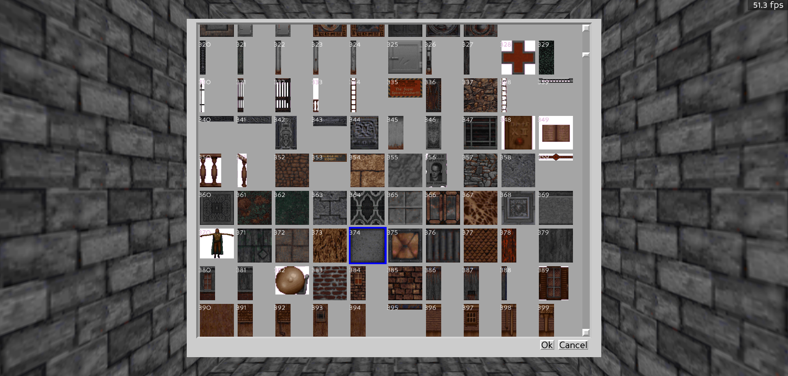

# Texture Selection

Texture (tile, picnum or what have you) selection in BlooM works very similar to mapedit. Simply [highlight or select](NAVIGATION.md###selecting-objects-in-3d) the item you wish to change the texture of an press `v`. The tile dialog will be displayed:

Here you can scroll through textures and click on the one you want to use. Pressing ok will confirm the selection, and cancel will abort.

 **Note: in some instances the above image shows white backgrounds where things should be transparent; not sure why this happens, but it should work correctly in BlooM itself**
