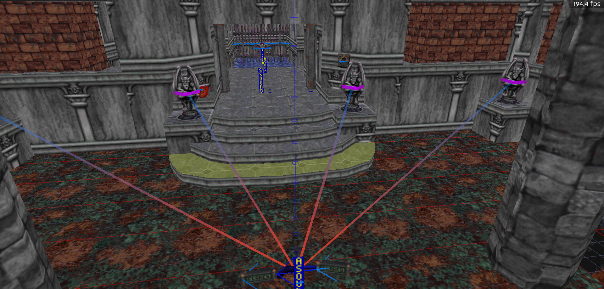
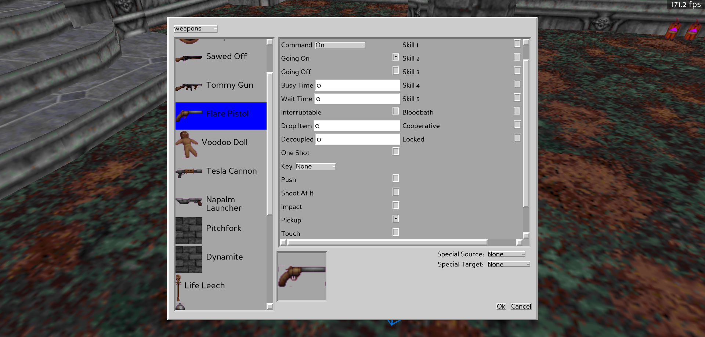

# Triggers In BlooM

Rather than deal with keeping track of tx/rx ids in BlooM, I've decided to do away with them entirely. Instead, to "bind" objects together in a transmit/receive fashion, you [select](NAVIGATION.md###selecting-objects-in-3d) the objects you wish to be the receivers, followed by the object you want to transmit/trigger them and then press the `b` key to bind them. A visual will appear on transmitting/receiving objects to show you how triggering happens. The action that is performed on the receiving object is determined by the `Command` in the [sprite properties](SPECIAL_SPRITES.md). The same can also be done with [sectors](SPECIAL_SECTORS.md).

View of the transmitter/receivers:

Sprite setup:

